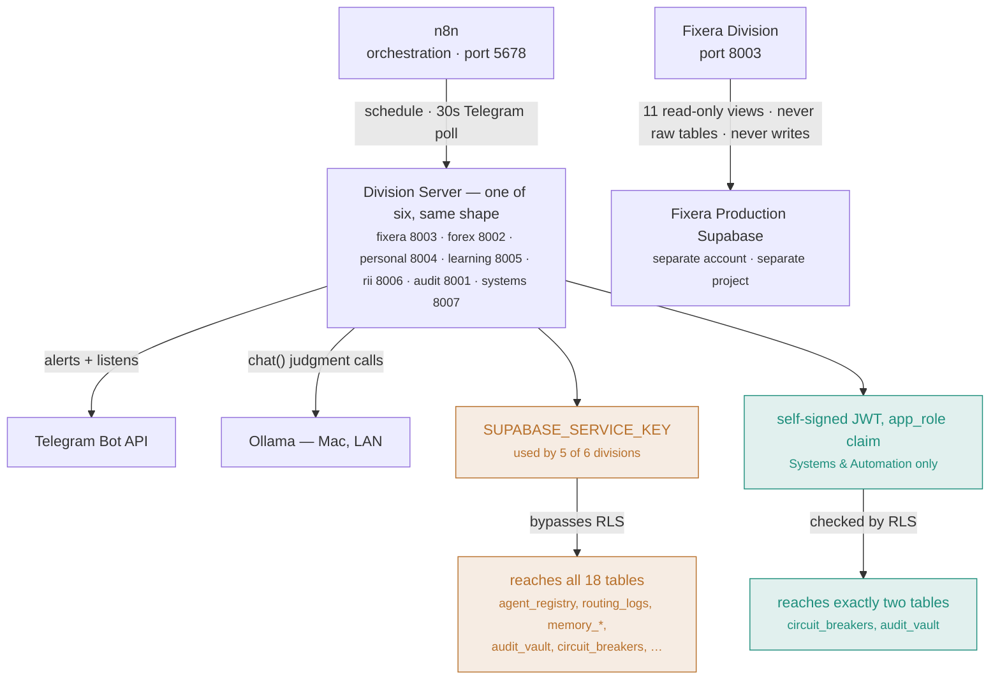

# AI_EMPIRE — System Architecture

**Owner:** Systems & Automation Division (System Architecture pillar)
**Status:** Living document — update this whenever a division, service, table, or integration is added or changed. This describes what actually exists and runs today, not the aspirational full spec (see `CONTEXT.md`'s "Implementation Phases" for where the project is headed).

## What this is

AI_EMPIRE is a personal multi-agent system running on a single Windows machine (plus one Mac for local LLM inference), organized into 6 divisions. Every division follows the same shape: a set of Python agent modules, a dedicated Telegram bot, an n8n workflow (scheduled and/or a 30-second Telegram poll), a FastAPI HTTP wrapper so n8n can trigger it (this n8n install has no shell-execution node), and entries in `agent_registry`.

## The 6 divisions

| Division | Port | Purpose |
|---|---|---|
| Fixera | 8003 | 8 agents supporting the separate, real Fixera home-services platform (own production Supabase, reached only via a scoped read-only connector — never shared credentials) |
| Forex | 8002 | 11 agents: research, strategy, psychology, journaling, risk management, market analytics, backtesting, performance review, CEO/Lead aggregation, and Entry & Exit (real MT5 execution, demo-only until Mohamed clears a real account) |
| Personal & Education | 8004 (Personal), 8005 (Learning) | Habit Tracker, Morning Executive Brief, Gmail/Calendar integration (Personal); SRS flashcards, content ingestion, curriculum tracker (Learning) |
| Research & Innovation | 8006 | Research Agent (real Tavily search + Ollama synthesis), Watchtowers (periodic topic monitoring) |
| Audit & Verification | 8001 | Security Audit, Financial Verification, Performance Monitor, Report Verification, QA, Bug Detection — the only division whose job is checking every other division |
| Systems & Automation | 8007 | Reliability & Monitoring Agent (live); Workflow Builder Agent (AI Automation pillar, on-demand, not scheduled); System Architecture (this document); Software Development tooling; the cybersecurity lab; Integration & APIs, Databases & Infrastructure, and the rest of Security & Performance remain unbuilt |

## How a division actually reaches data

Every division shares the same orchestration shape (n8n → a division server → Ollama/Telegram). What differs — and what actually matters — is how each one is allowed to touch the database underneath. Five divisions reach through a key that bypasses every restriction. One reaches through a claim the database itself checks, proven by trying to read what it shouldn't and watching it fail (see "Data layer" below for the full story).

*Amber = broad access, service-role key, RLS bypassed. Teal = scoped access, RLS-enforced, proven by a real negative test (`agent_registry`'s 37 real rows confirmed invisible to the scoped connector, 2026-08-06). Fixera's database sits outside both — reachable only through a permanently read-only connector, never write access.*

## Service topology

Everything runs locally, started manually per session (nothing persists across a machine restart yet — see "Known gaps" below):

- **n8n** (port 5678) — the orchestration layer. Every division's scheduled briefings and Telegram polling loops are n8n workflows (`infrastructure/n8n/*.json`) that hit each division's FastAPI wrapper over HTTP.
- **Ollama** (`OLLAMA_BASE_URL`, on a separate Mac, LAN IP drifts periodically) — the local model (`llama3.2:3b`) used for judgment-style tasks: RII's research synthesis, Learning's flashcard generation, Audit's QA review and bug-diagnosis, Systems' original scoped-role experiment. Deliberately NOT used for code-fix drafting (Bug Detection's `propose_fix()` stays stubbed) or anything requiring stronger reasoning than a 3B model reliably provides.
- **Division servers** — one `uvicorn` process per division on its own port (table above), each a thin FastAPI wrapper (`agents/<division>/server.py`) around real agent logic.
- **apps/api_gateway** (the Phase 1 Hybrid Router) exists in code but is **not currently running** as a persistent service — confirmed 2026-08-06. Not part of the live topology yet.

## Data layer

**AI_EMPIRE's own Supabase** (project `lkcfbmcjwmxxvtpjspgr`) holds 19 tables across two access patterns:

- `agent_registry`, `routing_logs`, `audit_vault` (immutable — a hard trigger blocks UPDATE/DELETE for every role, since RLS alone is bypassed by the service-role key), `job_queue`, `platform_settings`, `memory_knowledge`, `memory_experience`, `memory_identity`, `model_registry`, `prompt_registry`, `personal_habits`, `personal_habit_completions`, `learning_cards`, `learning_card_links`, `curriculum_phases`, `curriculum_subjects`, `rii_watchtowers`, `audit_performance_log`, `audit_bug_proposals`, `circuit_breakers`.
- **Access pattern 1 (audit, the central `api_gateway`, and — for a real, reproduced platform reason, not an oversight — `memory_experience`/`memory_knowledge` for every division):** `shared/db.py`'s `get_client()`, authenticated with the all-powerful `SUPABASE_SERVICE_KEY`, bypassing Row-Level Security entirely. Deferred deliberately for audit (it needs genuine cross-division, unfiltered reads on several tables — a different access shape than the other divisions, not yet designed) and for the multi-writer tables (`audit_vault`, `routing_logs`, `agent_registry` — shared across divisions, no single exclusive claim fits without more design work).
- **Access pattern 2 (Systems & Automation, Fixera, Forex, Personal & Education, Learning, and RII — for their own division-exclusive tables only):** a self-signed JWT carrying a custom `app_role: "<division>_agent"` claim, checked by real RLS policies. The JWT-minting mechanism itself lives in `shared/scoped_db.py`'s `get_scoped_client(app_role)` — generic, shared infra (extracted 2026-08-10 from `shared/systems_db_connector.py`, which had zero Systems-specific logic in its own client-minting code). Systems remains scoped to `circuit_breakers`/`audit_vault` only (`0010_systems_agent_rls_jwt.sql`), proven with real negative tests (2026-08-06) that it genuinely cannot read `agent_registry` or `routing_logs`. The other 5 divisions were scoped 2026-08-10 (`0014_five_divisions_rls_jwt.sql`) to exactly what each division's own code actually does — confirmed via a real audit of every `.table()` call across all 6 divisions, not guessed. **Working and live-verified with real positive and negative access tests:** `personal_habits`+`personal_habit_completions`, `learning_cards`+`learning_card_links`+`curriculum_phases`+`curriculum_subjects`, `rii_watchtowers` — a scoped client can read/write its own division-exclusive rows and genuinely cannot touch another division's (confirmed against real non-empty tables, not an empty-table coincidence).

**A real, reproduced platform blocker, not a policy mistake:** `memory_experience`/`memory_knowledge`'s RLS policies (also part of `0014`) reject every request under a scoped role — even an unconditionally-true `WITH CHECK (true)` policy on a brand-new throwaway table with the identical shape, created fresh within the same test transaction. These are the only two tables in the project with a pgvector `VECTOR` column; every table without one works correctly. Exhaustively ruled out via live diagnostic queries (2026-08-11): JWT claim reading, `app_role` matching, role switching (`current_user` confirmed `authenticated`), table-level grants, column-level grants, triggers, `FORCE ROW LEVEL SECURITY`, and the `vector` type's `USAGE` privilege — all correct. pgvector+RLS is a documented, normally-working combination elsewhere (it's a common multi-tenant RAG pattern), so this looks specific to this Supabase project, not a general incompatibility — but the cause remains unidentified. Same class of real, tracked-not-abandoned blocker as `governance/policies/systems_automation_governance.md` Rule 1's Supavisor pooler issue. **Workaround, not a fix:** `memory_experience`/`memory_knowledge` writes/reads stay on the blanket key for all divisions (the `0014` policies on these two tables are left in place in the database — harmless, just unused via this path). `shared/memory/experience.py`'s `add_experience()` and `shared/memory/knowledge.py`'s `add_knowledge()` gained an optional `client` parameter (unused for now, ready once/if this is ever resolved) — adding it never changed behavior for any caller.

**Fixera's production Supabase** (separate project, separate account) is reached only through `shared/fixera_connector.py`, a direct Postgres connection as the `ai_empire_reader` role via Supabase's session pooler, scoped to 11 read-only views (`infrastructure/fixera_connector_reference.sql`) that deliberately exclude PII, OTPs, national IDs, and free-text personal fields. No AI_EMPIRE agent ever touches Fixera's real tables directly, and nothing is ever written back.

## Model layer (added 2026-08-09 — flexible, not locked to one provider)

Mohamed's explicit request: don't hard-lock any of this to a single company's API.

- **`shared/memory/embeddings.py`** — `generate_embedding(text)`, provider chosen by `EMBEDDING_PROVIDER` (defaults to `"openai"`, auto-falls-back to the other on failure). Both providers write into the same 768-dimension `VECTOR(768)` column — OpenAI's `text-embedding-3-small` via its `dimensions=768` request parameter, Ollama's via `nomic-embed-text`'s native 768-dim output. Embeddings from different providers are NOT semantically comparable to each other even though the dimension matches; switching the active provider means old embeddings should be regenerated, not mixed. `memory_knowledge`/`memory_experience`'s HNSW indexes (`infrastructure/database/migrations/0011_flexible_embeddings_768.sql`, `0012_hnsw_embedding_index.sql`) make real semantic search actually work now — live-verified with a genuine (non-self-match) query/result pair.
- **`shared/models/generate.py`** — `chat(prompt, system=None, provider=None, model=None)`, provider chosen by `CHAT_PROVIDER` (defaults to `"ollama"`, Mohamed's primary backend most of the time) or an explicit `provider=` argument: `"ollama"`, `"openai"`, or `"anthropic"`. Unlike embeddings, this does NOT auto-fall-back across providers — different providers' answers have real quality/behavior differences a caller should see and control explicitly, not have silently swapped. `shared/models/ollama_client.py`'s original `chat()` (Ollama-only, used directly by RII/Learning/Audit today) still exists unchanged; `generate.py` is the newer, provider-flexible option for anything built going forward.
- `ANTHROPIC_API_KEY` is still a placeholder (`REPLACE_ME`) in `.env` — the `"anthropic"` provider option is real and ready, reports itself unconfigured rather than failing oddly, until a real key is added.

## Learning engine abstraction (added 2026-08-09)

Learning Division's real, working SM-2 spaced-repetition system (`agents/learning/srs.py`) stays the production engine — but `content_transform.py` and `telegram_listener.py` now call `agents/learning/engine.py`'s `get_learning_engine()` rather than importing `srs.py` directly. `SM2LearningEngine` is a thin wrapper that delegates every scheduling method straight to `srs.py`, unchanged; `LEARNING_ENGINE` (defaults to `"sm2"`) is the one place a different engine would ever be registered.

This exists specifically so **Orbit** (Andy Matuschak's spaced-repetition research project) could be integrated later without touching the rest of Learning Division — investigated live 2026-08-09: it does have a real REST API, but is built around Andy Matuschak's own hosted cloud service and its maintainer says it "does not aspire to be a typical open-source project." Given that, and that the custom SM-2 system is already real and fully self-owned, the decision was to keep SM-2 as production and borrow Orbit's *ideas*, not depend on its service:
- **Contextual prompts embedded in learning material** — already real: every card keeps `source_type`/`source_reference` from whatever it was generated from.
- **Active recall + spaced review** — what SM-2 already does.
- **Knowledge-linked prompts** — new: `learning_card_links` (`infrastructure/database/migrations/0013_learning_card_links.sql`), a bidirectional join table so a card can reference related cards, the same linking idea Obsidian uses for notes, applied to flashcards. `SM2LearningEngine.link_cards()`/`get_linked_cards()`.

## External integrations

| Integration | Used by | Notes |
|---|---|---|
| Ollama (Mac, local LLM) | RII, Learning, Audit (QA + Bug Detection) | IP drifts on the LAN; check `.env`'s `OLLAMA_BASE_URL` if a division reports it unreachable |
| Telegram (one bot per division) | Every division | `TELEGRAM_{DIVISION}_BOT_TOKEN` + shared `TELEGRAM_CHAT_ID`; each division has its own `_telegram.py`/`telegram_listener.py`, deliberately duplicated rather than shared |
| Tavily | RII | Real web search, replaced an earlier DuckDuckGo-scraping approach that got blocked in live testing |
| Google OAuth | Personal | Gmail (read-only) + Calendar |
| MetaTrader5 | Forex | Requires a locally-running MT5 terminal; Windows-only, which is why CI doesn't install the full `requirements.txt` |
| Docker (via WSL2) | Systems & Automation | The cybersecurity lab (OWASP Juice Shop, bound to `127.0.0.1` only) |
| TradingView webhook (Vercel) | Forex, via Systems & Automation's Integration & APIs pillar | `infrastructure/tradingview_webhook/api/webhook.js`, deployed as its own Vercel project (`ai-empire`, root directory set to this subfolder) at `ai-empire-nu.vercel.app/api/webhook`. Relays Mohamed's own Pine Script alerts to Telegram + logs to `memory_knowledge` — pure visibility, never feeds any execution path. Confirmed live and working end-to-end 2026-08-11 (real request → real Telegram message → real Supabase row). A real bug was found and fixed the same day: the handler was logging the *entire* raw request body — including the `secret` field itself — into `metadata.raw`, meaning every alert re-exposed the current webhook secret inside a table most of the codebase can read via the blanket service-role key. Fixed by stripping `secret` before logging. `WEBHOOK_SECRET` was rotated as part of finding this (Vercel marks it "Sensitive" — write-only, can't be read back once saved, so testing required setting a new known value) — **rotate it again**, since the old value had already been exposed in the database twice (once from an earlier untracked 2026-07-27 test, once from this session's own verification, both now deleted) before the fix landed. TradingView's webhook-alerts feature requires at least their paid Essential plan — whether that's been upgraded, and whether the actual Pine Script alert has been configured with the new secret, is still open.

## Dev tooling (added 2026-08-07)

- **Ruff** — lint + format, config in `pyproject.toml`.
- **pytest** — real tests in `tests/`, currently covering the Systems & Automation circuit-breaker state machine. `pythonpath = ["."]` in `pyproject.toml` is required for `agents.*`/`shared.*` imports to resolve — `python -m pytest` doesn't need it (adds cwd to `sys.path` automatically) but the bare `pytest` command CI runs does.
- **pre-commit** — `ruff check`, `ruff format --check`, and `infrastructure/scripts/secret_scan.py`, installed into `.git/hooks/pre-commit`. Hook `entry:` paths must be absolute (`C:/moh-sudo/.venv/Scripts/...`) — a relative `.venv/Scripts/...` path did not resolve correctly under pre-commit's own subprocess invocation on Windows.
- **GitHub Actions CI** (`.github/workflows/ci.yml`) — runs the same three checks plus pytest on every push to `moh-sudo/AI-EMPIRE`. Installs only `requirements-dev.txt` + `requests`, not the full `requirements.txt` (MetaTrader5 is Windows-only and can't install on the Linux runner).
- **`gh` CLI** — installed and authenticated as `moh-sudo`, so CI status can be checked directly rather than only through GitHub's web UI.

## Governance

`governance/constitution/` and `governance/policies/` hold the real (not aspirational) rules currently in force:
- `self_healing_governance.md` — the 12-rule policy + Two-Agent Rule governing any autonomous bug-fixing (Audit's Bug Detection).
- `law_13_security.md` + `security_audit_policy.md` — the security audit's scope and honest status (what's really checked vs. what doesn't apply yet to a single-machine setup).
- `systems_automation_governance.md` — the 10-rule policy for Systems & Automation specifically, since it's the first division whose agents can kill/restart real processes. Includes the real status of database-level access enforcement (Rule 1) and the cybersecurity lab's credential air-gap (Rule 8). Also has an **Escalation Chain** (names the people/personas behind `self_healing_governance.md`'s existing abstract verification flow — Abdullahi → Huda → Abdi → Mohamed — rather than a new mechanism) and a **Database Governance Pillar** (2026-08-10, written down after the fact from what's actually governed every real database change so far: migrations only, Mohamed runs every one himself, RLS extended incrementally, nothing deleted without explicit confirmation).

## Known gaps (honest, not hidden)

- **Nothing persists across a machine restart.** n8n and every division server must be manually restarted each session (`netstat -ano` for ports 5678/8001-8007 to check what's actually running).
- **~~Access pattern 1 (the blanket service-role key) is still what 5 of 6 divisions use~~ — PARTIALLY RESOLVED, 2026-08-10/11.** Migration `0014` ran against production and is live-verified with real positive and negative access tests: Fixera, Forex, Personal & Education, Learning, and RII now use scoped RLS+JWT for their own division-exclusive tables (`personal_habits`, `learning_cards`, `rii_watchtowers`, etc.), matching Systems & Automation's proven pattern. **`memory_experience`/`memory_knowledge` specifically stay on the blanket key for every division** — not an oversight, a real reproduced platform blocker (see the "real, reproduced platform blocker" note above: these are the only 2 tables with a pgvector column, and RLS rejects every request under a scoped role for reasons exhaustively ruled out but not identified). **Still fully on the blanket key:** audit (different access shape, deliberately deferred) and the multi-writer tables (`audit_vault`, `routing_logs`, `agent_registry`).
- **`apps/api_gateway`** (the originally-planned Hybrid Router) isn't running as a live service. Nothing currently depends on it.
- **No architectural-consistency enforcement exists yet** — a future Systems & Automation agent could check that new divisions follow the established `_telegram.py`/`_memory_helpers.py`/`server.py` pattern automatically; today that's just convention, checked by a human (or Claude) reading the code.
- **The AI Automation pillar has its first agent: Workflow Builder** (`agents/systems/workflow_builder.py`, governed under `systems_automation_governance.md`'s new 2026-08-10 line item). Turns a plain-language description into a new n8n workflow JSON file matching the exact two-node (`scheduleTrigger` → `httpRequest`) pattern every one of the 16 existing workflows uses — an Ollama judgment call interprets the description into structured parameters (division, trigger type/value, endpoint), then a deterministic template builds the actual JSON, so the model never writes JSON directly. Action scope is deliberately narrow: it only ever writes a *new* file for Mohamed to review and manually import — never touches a live n8n instance, never overwrites an existing workflow. Two real prompt-quality bugs were found and fixed via live testing, not just unit tests: the model initially echoed example values from the prompt instead of extracting from the real description (fixed by explicitly warning against reuse and separating instructions from examples more clearly), and it initially misjudged "twice a day, at 6am and 6pm" as a simple interval instead of a cron trigger aligned to specific clock times (fixed with explicit interval-vs-cron guidance and a second worked example). Live-verified after both fixes with two genuinely different descriptions (not the prompt's own examples), producing correct, schema-matching output each time.
- **~~OpenAI embeddings have never actually worked~~ — RESOLVED 2026-08-09.** `OPENAI_API_KEY` still has `insufficient_quota` (Mohamed's own billing decision, pending), but `shared/memory/embeddings.py` is now flexible — `EMBEDDING_PROVIDER` (defaults to trying OpenAI first) automatically falls back to Ollama (`nomic-embed-text`, 768-dim) when OpenAI fails. Semantic search now genuinely works, live-verified with a real query/match (similarity 0.723 on a real semantically-related pair, not a coincidental self-match). A real bug was found and fixed along the way: the `ivfflat` index on both embedding columns used `lists = 100`, wildly oversharded for a table with 1-2 real rows — approximate search essentially never found a true match unless the query vector was byte-identical to a stored one. Fixed by switching to `HNSW` (`0012_hnsw_embedding_index.sql`), which doesn't have this small-dataset pathology. `shared/models/generate.py` similarly offers a flexible `chat()` across Ollama/OpenAI/Anthropic — Ollama is Mohamed's primary/default provider most of the time; Anthropic is real and ready but `ANTHROPIC_API_KEY` is still a placeholder.
- **~~Speech-to-text was stubbed~~ — RESOLVED 2026-08-10.** `shared/voice/speech_to_text.py` now runs `faster-whisper` in-process, locally, on the Windows machine — not on the Mac. Earlier plans (and `infrastructure/mac/whisper_server.py`, since removed) assumed a Mac-hosted networked server, mirroring the Ollama pattern; that was the wrong model — the Mac is reserved for Ollama specifically because that needs its specs, transcription doesn't, and everything else already runs here. Model size is configurable (`WHISPER_MODEL_SIZE`, default `base`). Live-verified with genuine speech (not just error-free runs): `transcribe()` correctly returned real spoken words. Two real bugs were found and fixed along the way — `record_audio()` hung on this machine's implicit default-device resolution (fixed with an explicit `device=` argument) and Windows Defender was silently adding minutes of overhead scanning native libraries/model files on every run (fixed with a real-time-scanning exclusion for `.venv` and the Hugging Face cache).

**Text-to-speech is also real now**, via `pyttsx3` (Windows SAPI5, offline, no model download) in `shared/voice/text_to_speech.py` — much lighter than STT since there's no native ML dependency chain. Live-verified: synthesized speech played back audibly through real speakers.

**Obsidian's write-integration is real now**, via `shared/obsidian/vault.py`'s `write_note()`. Obsidian itself is just a markdown-file viewer over a folder — writing a note requires no Obsidian installation, no API, no running process, just a file on disk; Obsidian picks it up next time it's opened. Vault location is configurable (`OBSIDIAN_VAULT_PATH`); a fresh vault was created at `~/Documents/AI_EMPIRE_Vault` since Mohamed didn't have one yet. One markdown file per capture (timestamped filename, YAML frontmatter carrying `source_type`/`source_reference` — the same field pair used on learning cards), dropped in `Inbox/` for filing later. Live-verified with a real note written and read back correctly.

**The "route intelligently" classification logic is real now too**, via `interfaces/voice_capture.py`'s `classify_capture()`/`route_capture()`. Lives under `interfaces/`, not `agents/learning/` or `shared/`, for the same cross-division reasoning as `voice_session.py` — it decides between two independent, unchanged destinations rather than belonging to either one. The decision itself is a judgment call through `shared/models/generate.py`'s `chat()` (same Ollama-by-default pattern as every other classification task in this project), not a hardcoded rule — a short system prompt asks for `LEARNING: <category>` or `OBSIDIAN`, parsed from the reply. Fails safe: if the model call fails or the reply can't be parsed, it defaults to Obsidian rather than dropping the capture, since a mis-filed note is recoverable and a lost one isn't. Live-verified with two genuinely different real inputs — a factual statement correctly routed to Learning and produced 3 real flashcards; an open-ended thought correctly routed to Obsidian and produced a real note — proving actual dispatch, not just classification.

**Voice-note handling now exists on every division's bot, not just Learning's.** Each bot's message dispatch checks for a voice note when there's no plain text, downloads it via `shared/telegram_files.py`'s `download_telegram_file()` (extracted from Learning's original implementation into genuinely shared infra — it's the same two Telegram API calls regardless of which bot is asking, unlike `_telegram.py`/`telegram_listener.py` which stay deliberately duplicated per division since they carry real division-specific logic), transcribes it via `shared/voice/speech_to_text.py`, and feeds the result into that bot's existing text-dispatch logic — a voice note is just an alternate way of sending the same text, not a separate code path per division. Real phone calling (Twilio) is a separate, larger, not-yet-started decision.

### Wake word + agent identities

**Named identities are real now.** `shared/agent_identities.py`'s `DIVISION_NAMES` maps each division to a real human name Mohamed chose (Fixera → Mahir, Forex → Abdisalam, Personal & Education / Learning → Sumaya, Research & Innovation → Zainab, Audit & Verification → Huda, Systems & Automation → Abdullahi), plus `SUPREME_BOSS` ("Abdi", nicknamed "Loverboy" — Mohamed's own addition). `name_for(division)` falls back to the supreme boss for an unknown key rather than raising. Wired into `interfaces/voice_session.py` so a voice conversation is attributed to the actual person's name, not just a division label — proportional scope: rather than touching all 7 bots' Telegram message text, the registry exists as the single source of truth and is wired into the one interface where talking to a specific division agent by name matters most.

**The clap + "wake up" hands-free trigger is built** (`interfaces/wake_listener.py`, `python -m interfaces.wake_listener`), a long-lived background loop rather than a one-shot script — clap arms a short listening window (peak amplitude ≥ 1800, a threshold set from a real calibration recording on this machine, not guessed), then a `faster-whisper` check on the next few seconds looks for "wake up"; only if that's heard does it record a real capture and route it through `voice_capture.py`'s `route_capture()`. The two-stage design keeps the continuously-running part cheap (a peak-amplitude check on every audio chunk) and only pays for the expensive part (transcription) after a clap fires. All of its own status messages speak as "Abdi (Loverboy)". Making this survive a machine restart (e.g. Task Scheduler) is a separate, later step, matching how n8n and the division servers already need manual restart each session.

**Two real bugs found and fixed getting this reliable, both root-caused from real evidence, not guessed:**

1. **Transcription speed was inconsistent because the laptop was running on battery**, not AC power — confirmed via `PowerStatus.PowerLineStatus`, on Windows' "Balanced" plan, on a genuinely modest CPU (Intel i3-7100U, dual-core/4-thread, 15W). Windows throttles harder under sustained load on battery, explaining why a first `faster-whisper` call would complete normally but a second one shortly after would stall for minutes. Fixed by staying on AC power and switching to Windows 11's "Best performance" power mode — confirmed with three consecutive fast, consistent transcription calls (12.4s, 5.9s, 7.2s) where every prior live attempt had blown up on the second call.
2. **The audio queue accumulated a stale backlog during any slow processing step**, and the next capture would drain that backlog instead of fresh audio — proven when an 8-second capture request came back as a 17.5-second recording. `_drain_queue()` empties the queue non-blockingly before both the clap-check and the final capture, verified in isolation (a simulated 10s backlog drained to zero, then a fresh 2s window correctly collected ~1.80s, not an inflated amount).
