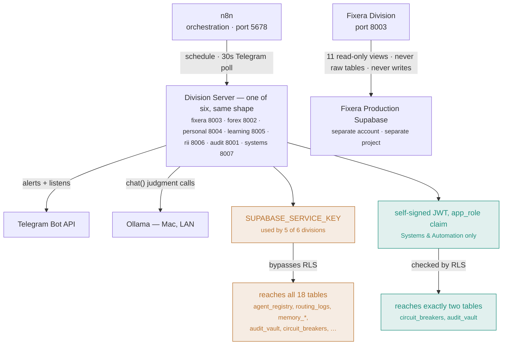

# AI_EMPIRE — System Architecture

**Owner:** Systems & Automation Division (System Architecture pillar)
**Status:** Living document — update this whenever a division, service, table, or integration is added or changed. This describes what actually exists and runs today, not the aspirational full spec (see `CONTEXT.md`'s "Implementation Phases" for where the project is headed).

## What this is

AI_EMPIRE is a personal multi-agent system running on a single Windows machine (plus one Mac for local LLM inference), organized into 6 divisions. Every division follows the same shape: a set of Python agent modules, a dedicated Telegram bot, an n8n workflow (scheduled and/or a 30-second Telegram poll), a FastAPI HTTP wrapper so n8n can trigger it (this n8n install has no shell-execution node), and entries in `agent_registry`.

## The 6 divisions

| Division | Port | Purpose |
|---|---|---|
| Fixera | 8003 | 8 agents supporting the separate, real Fixera home-services platform (own production Supabase, reached only via a scoped read-only connector — never shared credentials) |
| Forex | 8002 | 11 agents: research, strategy, psychology, journaling, risk management, market analytics, backtesting, performance review, CEO/Lead aggregation, and Entry & Exit (real MT5 execution, demo-only until Mohamed clears a real account) |
| Personal & Education | 8004 (Personal), 8005 (Learning) | Habit Tracker, Morning Executive Brief, Gmail/Calendar integration (Personal); SRS flashcards, content ingestion, curriculum tracker (Learning) |
| Research & Innovation | 8006 | Research Agent (real Tavily search + Ollama synthesis), Watchtowers (periodic topic monitoring) |
| Audit & Verification | 8001 | Security Audit, Financial Verification, Performance Monitor, Report Verification, QA, Bug Detection — the only division whose job is checking every other division |
| Systems & Automation | 8007 | Reliability & Monitoring Agent (live); System Architecture (this document); Software Development tooling; the cybersecurity lab; AI Automation, Integration & APIs, Databases & Infrastructure, and the rest of Security & Performance remain unbuilt |

## How a division actually reaches data

Every division shares the same orchestration shape (n8n → a division server → Ollama/Telegram). What differs — and what actually matters — is how each one is allowed to touch the database underneath. Five divisions reach through a key that bypasses every restriction. One reaches through a claim the database itself checks, proven by trying to read what it shouldn't and watching it fail (see "Data layer" below for the full story).

*Amber = broad access, service-role key, RLS bypassed. Teal = scoped access, RLS-enforced, proven by a real negative test (`agent_registry`'s 37 real rows confirmed invisible to the scoped connector, 2026-08-06). Fixera's database sits outside both — reachable only through a permanently read-only connector, never write access.*

## Service topology

Everything runs locally, started manually per session (nothing persists across a machine restart yet — see "Known gaps" below):

- **n8n** (port 5678) — the orchestration layer. Every division's scheduled briefings and Telegram polling loops are n8n workflows (`infrastructure/n8n/*.json`) that hit each division's FastAPI wrapper over HTTP.
- **Ollama** (`OLLAMA_BASE_URL`, on a separate Mac, LAN IP drifts periodically) — the local model (`llama3.2:3b`) used for judgment-style tasks: RII's research synthesis, Learning's flashcard generation, Audit's QA review and bug-diagnosis, Systems' original scoped-role experiment. Deliberately NOT used for code-fix drafting (Bug Detection's `propose_fix()` stays stubbed) or anything requiring stronger reasoning than a 3B model reliably provides.
- **Division servers** — one `uvicorn` process per division on its own port (table above), each a thin FastAPI wrapper (`agents/<division>/server.py`) around real agent logic.
- **apps/api_gateway** (the Phase 1 Hybrid Router) exists in code but is **not currently running** as a persistent service — confirmed 2026-08-06. Not part of the live topology yet.

## Data layer

**AI_EMPIRE's own Supabase** (project `lkcfbmcjwmxxvtpjspgr`) holds 19 tables across two access patterns:

- `agent_registry`, `routing_logs`, `audit_vault` (immutable — a hard trigger blocks UPDATE/DELETE for every role, since RLS alone is bypassed by the service-role key), `job_queue`, `platform_settings`, `memory_knowledge`, `memory_experience`, `memory_identity`, `model_registry`, `prompt_registry`, `personal_habits`, `personal_habit_completions`, `learning_cards`, `learning_card_links`, `curriculum_phases`, `curriculum_subjects`, `rii_watchtowers`, `audit_performance_log`, `audit_bug_proposals`, `circuit_breakers`.
- **Access pattern 1 (everything except Systems & Automation):** `shared/db.py`'s `get_client()`, authenticated with the all-powerful `SUPABASE_SERVICE_KEY`. This is the project-wide default and bypasses Row-Level Security entirely — a real, acknowledged, systemic gap (see `governance/policies/systems_automation_governance.md`, Rule 1).
- **Access pattern 2 (Systems & Automation only, so far):** `shared/systems_db_connector.py` — a self-signed JWT carrying a custom `app_role: systems_agent` claim, checked by real RLS policies (`infrastructure/database/migrations/0010_systems_agent_rls_jwt.sql`) that only allow touching `circuit_breakers` and `audit_vault`. Proven with real negative tests (2026-08-06): the connector genuinely cannot read `agent_registry` or `routing_logs`, verified against real non-empty tables, not an empty-table coincidence. This is the model future divisions' agents should move toward, not pattern 1.

**Fixera's production Supabase** (separate project, separate account) is reached only through `shared/fixera_connector.py`, a direct Postgres connection as the `ai_empire_reader` role via Supabase's session pooler, scoped to 11 read-only views (`infrastructure/fixera_connector_reference.sql`) that deliberately exclude PII, OTPs, national IDs, and free-text personal fields. No AI_EMPIRE agent ever touches Fixera's real tables directly, and nothing is ever written back.

## Model layer (added 2026-08-09 — flexible, not locked to one provider)

Mohamed's explicit request: don't hard-lock any of this to a single company's API.

- **`shared/memory/embeddings.py`** — `generate_embedding(text)`, provider chosen by `EMBEDDING_PROVIDER` (defaults to `"openai"`, auto-falls-back to the other on failure). Both providers write into the same 768-dimension `VECTOR(768)` column — OpenAI's `text-embedding-3-small` via its `dimensions=768` request parameter, Ollama's via `nomic-embed-text`'s native 768-dim output. Embeddings from different providers are NOT semantically comparable to each other even though the dimension matches; switching the active provider means old embeddings should be regenerated, not mixed. `memory_knowledge`/`memory_experience`'s HNSW indexes (`infrastructure/database/migrations/0011_flexible_embeddings_768.sql`, `0012_hnsw_embedding_index.sql`) make real semantic search actually work now — live-verified with a genuine (non-self-match) query/result pair.
- **`shared/models/generate.py`** — `chat(prompt, system=None, provider=None, model=None)`, provider chosen by `CHAT_PROVIDER` (defaults to `"ollama"`, Mohamed's primary backend most of the time) or an explicit `provider=` argument: `"ollama"`, `"openai"`, or `"anthropic"`. Unlike embeddings, this does NOT auto-fall-back across providers — different providers' answers have real quality/behavior differences a caller should see and control explicitly, not have silently swapped. `shared/models/ollama_client.py`'s original `chat()` (Ollama-only, used directly by RII/Learning/Audit today) still exists unchanged; `generate.py` is the newer, provider-flexible option for anything built going forward.
- `ANTHROPIC_API_KEY` is still a placeholder (`REPLACE_ME`) in `.env` — the `"anthropic"` provider option is real and ready, reports itself unconfigured rather than failing oddly, until a real key is added.

## Learning engine abstraction (added 2026-08-09)

Learning Division's real, working SM-2 spaced-repetition system (`agents/learning/srs.py`) stays the production engine — but `content_transform.py` and `telegram_listener.py` now call `agents/learning/engine.py`'s `get_learning_engine()` rather than importing `srs.py` directly. `SM2LearningEngine` is a thin wrapper that delegates every scheduling method straight to `srs.py`, unchanged; `LEARNING_ENGINE` (defaults to `"sm2"`) is the one place a different engine would ever be registered.

This exists specifically so **Orbit** (Andy Matuschak's spaced-repetition research project) could be integrated later without touching the rest of Learning Division — investigated live 2026-08-09: it does have a real REST API, but is built around Andy Matuschak's own hosted cloud service and its maintainer says it "does not aspire to be a typical open-source project." Given that, and that the custom SM-2 system is already real and fully self-owned, the decision was to keep SM-2 as production and borrow Orbit's *ideas*, not depend on its service:
- **Contextual prompts embedded in learning material** — already real: every card keeps `source_type`/`source_reference` from whatever it was generated from.
- **Active recall + spaced review** — what SM-2 already does.
- **Knowledge-linked prompts** — new: `learning_card_links` (`infrastructure/database/migrations/0013_learning_card_links.sql`), a bidirectional join table so a card can reference related cards, the same linking idea Obsidian uses for notes, applied to flashcards. `SM2LearningEngine.link_cards()`/`get_linked_cards()`.

## External integrations

| Integration | Used by | Notes |
|---|---|---|
| Ollama (Mac, local LLM) | RII, Learning, Audit (QA + Bug Detection) | IP drifts on the LAN; check `.env`'s `OLLAMA_BASE_URL` if a division reports it unreachable |
| Telegram (one bot per division) | Every division | `TELEGRAM_{DIVISION}_BOT_TOKEN` + shared `TELEGRAM_CHAT_ID`; each division has its own `_telegram.py`/`telegram_listener.py`, deliberately duplicated rather than shared |
| Tavily | RII | Real web search, replaced an earlier DuckDuckGo-scraping approach that got blocked in live testing |
| Google OAuth | Personal | Gmail (read-only) + Calendar |
| MetaTrader5 | Forex | Requires a locally-running MT5 terminal; Windows-only, which is why CI doesn't install the full `requirements.txt` |
| Docker (via WSL2) | Systems & Automation | The cybersecurity lab (OWASP Juice Shop, bound to `127.0.0.1` only) |

## Dev tooling (added 2026-08-07)

- **Ruff** — lint + format, config in `pyproject.toml`.
- **pytest** — real tests in `tests/`, currently covering the Systems & Automation circuit-breaker state machine. `pythonpath = ["."]` in `pyproject.toml` is required for `agents.*`/`shared.*` imports to resolve — `python -m pytest` doesn't need it (adds cwd to `sys.path` automatically) but the bare `pytest` command CI runs does.
- **pre-commit** — `ruff check`, `ruff format --check`, and `infrastructure/scripts/secret_scan.py`, installed into `.git/hooks/pre-commit`. Hook `entry:` paths must be absolute (`C:/moh-sudo/.venv/Scripts/...`) — a relative `.venv/Scripts/...` path did not resolve correctly under pre-commit's own subprocess invocation on Windows.
- **GitHub Actions CI** (`.github/workflows/ci.yml`) — runs the same three checks plus pytest on every push to `moh-sudo/AI-EMPIRE`. Installs only `requirements-dev.txt` + `requests`, not the full `requirements.txt` (MetaTrader5 is Windows-only and can't install on the Linux runner).
- **`gh` CLI** — installed and authenticated as `moh-sudo`, so CI status can be checked directly rather than only through GitHub's web UI.

## Governance

`governance/constitution/` and `governance/policies/` hold the real (not aspirational) rules currently in force:
- `self_healing_governance.md` — the 12-rule policy + Two-Agent Rule governing any autonomous bug-fixing (Audit's Bug Detection).
- `law_13_security.md` + `security_audit_policy.md` — the security audit's scope and honest status (what's really checked vs. what doesn't apply yet to a single-machine setup).
- `systems_automation_governance.md` — the 10-rule policy for Systems & Automation specifically, since it's the first division whose agents can kill/restart real processes. Includes the real status of database-level access enforcement (Rule 1) and the cybersecurity lab's credential air-gap (Rule 8).

## Known gaps (honest, not hidden)

- **Nothing persists across a machine restart.** n8n and every division server must be manually restarted each session (`netstat -ano` for ports 5678/8001-8007 to check what's actually running).
- **Access pattern 1 (the blanket service-role key) is still what 5 of 6 divisions use.** The RLS+JWT pattern proven for Systems & Automation is real, tested, and ready to replicate — just not done yet for the others.
- **`apps/api_gateway`** (the originally-planned Hybrid Router) isn't running as a live service. Nothing currently depends on it.
- **No architectural-consistency enforcement exists yet** — a future Systems & Automation agent could check that new divisions follow the established `_telegram.py`/`_memory_helpers.py`/`server.py` pattern automatically; today that's just convention, checked by a human (or Claude) reading the code.
- **~~OpenAI embeddings have never actually worked~~ — RESOLVED 2026-08-09.** `OPENAI_API_KEY` still has `insufficient_quota` (Mohamed's own billing decision, pending), but `shared/memory/embeddings.py` is now flexible — `EMBEDDING_PROVIDER` (defaults to trying OpenAI first) automatically falls back to Ollama (`nomic-embed-text`, 768-dim) when OpenAI fails. Semantic search now genuinely works, live-verified with a real query/match (similarity 0.723 on a real semantically-related pair, not a coincidental self-match). A real bug was found and fixed along the way: the `ivfflat` index on both embedding columns used `lists = 100`, wildly oversharded for a table with 1-2 real rows — approximate search essentially never found a true match unless the query vector was byte-identical to a stored one. Fixed by switching to `HNSW` (`0012_hnsw_embedding_index.sql`), which doesn't have this small-dataset pathology. `shared/models/generate.py` similarly offers a flexible `chat()` across Ollama/OpenAI/Anthropic — Ollama is Mohamed's primary/default provider most of the time; Anthropic is real and ready but `ANTHROPIC_API_KEY` is still a placeholder.
- **~~Speech-to-text was stubbed~~ — RESOLVED 2026-08-10.** `shared/voice/speech_to_text.py` now runs `faster-whisper` in-process, locally, on the Windows machine — not on the Mac. Earlier plans (and `infrastructure/mac/whisper_server.py`, since removed) assumed a Mac-hosted networked server, mirroring the Ollama pattern; that was the wrong model — the Mac is reserved for Ollama specifically because that needs its specs, transcription doesn't, and everything else already runs here. Model size is configurable (`WHISPER_MODEL_SIZE`, default `base`). Live-verified with genuine speech (not just error-free runs): `transcribe()` correctly returned real spoken words. Two real bugs were found and fixed along the way — `record_audio()` hung on this machine's implicit default-device resolution (fixed with an explicit `device=` argument) and Windows Defender was silently adding minutes of overhead scanning native libraries/model files on every run (fixed with a real-time-scanning exclusion for `.venv` and the Hugging Face cache).

**Text-to-speech is also real now**, via `pyttsx3` (Windows SAPI5, offline, no model download) in `shared/voice/text_to_speech.py` — much lighter than STT since there's no native ML dependency chain. Live-verified: synthesized speech played back audibly through real speakers.

**Obsidian's write-integration is real now**, via `shared/obsidian/vault.py`'s `write_note()`. Obsidian itself is just a markdown-file viewer over a folder — writing a note requires no Obsidian installation, no API, no running process, just a file on disk; Obsidian picks it up next time it's opened. Vault location is configurable (`OBSIDIAN_VAULT_PATH`); a fresh vault was created at `~/Documents/AI_EMPIRE_Vault` since Mohamed didn't have one yet. One markdown file per capture (timestamped filename, YAML frontmatter carrying `source_type`/`source_reference` — the same field pair used on learning cards), dropped in `Inbox/` for filing later. Live-verified with a real note written and read back correctly. **Not yet built:** the "route intelligently" classification logic (quick fact → SM2 learning engine, general thought → Obsidian) — right now writing to either destination requires calling the right function directly; nothing decides that automatically yet.

Voice-note handling only exists on Learning's Telegram bot today; every other division's bot is text-only. Real phone calling (Twilio) is a separate, larger, not-yet-started decision.
