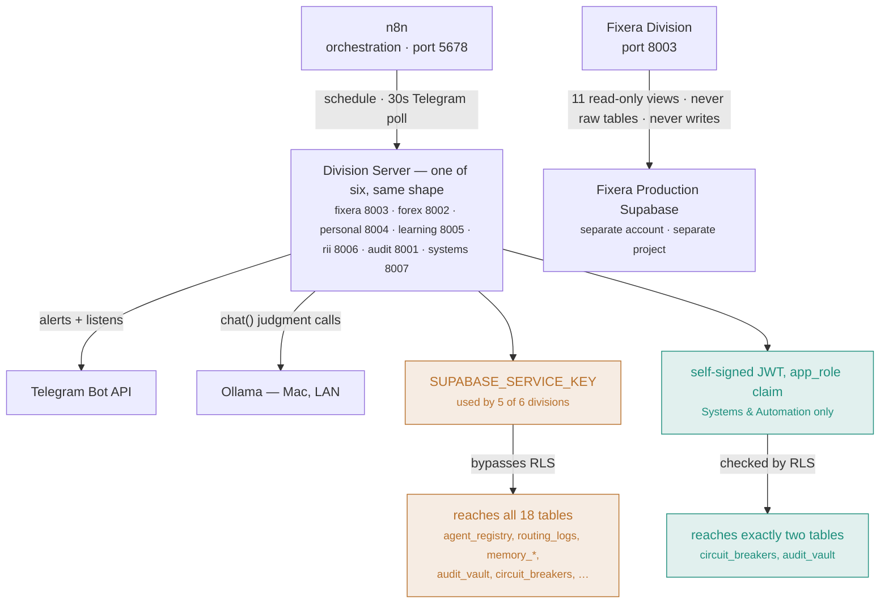

# AI_EMPIRE — System Architecture

**Owner:** Systems & Automation Division (System Architecture pillar)
**Status:** Living document — update this whenever a division, service, table, or integration is added or changed. This describes what actually exists and runs today, not the aspirational full spec (see `CONTEXT.md`'s "Implementation Phases" for where the project is headed).

## What this is

AI_EMPIRE is a personal multi-agent system running on a single Windows machine (plus one Mac for local LLM inference), organized into 6 divisions. Every division follows the same shape: a set of Python agent modules, a dedicated Telegram bot, an n8n workflow (scheduled and/or a 30-second Telegram poll), a FastAPI HTTP wrapper so n8n can trigger it (this n8n install has no shell-execution node), and entries in `agent_registry`.

## The 6 divisions

| Division | Port | Purpose |
|---|---|---|
| Fixera | 8003 | 8 agents supporting the separate, real Fixera home-services platform (own production Supabase, reached only via a scoped read-only connector — never shared credentials) |
| Forex | 8002 | 11 agents: research, strategy, psychology, journaling, risk management, market analytics, backtesting, performance review, CEO/Lead aggregation, and Entry & Exit (real MT5 execution, demo-only until Mohamed clears a real account) |
| Personal & Education | 8004 (Personal), 8005 (Learning) | Habit Tracker, Morning Executive Brief, Gmail/Calendar integration (Personal); SRS flashcards, content ingestion, curriculum tracker (Learning) |
| Research & Innovation | 8006 | Research Agent (real Tavily search + Ollama synthesis), Watchtowers (periodic topic monitoring) |
| Audit & Verification | 8001 | Security Audit, Financial Verification, Performance Monitor, Report Verification, QA, Bug Detection — the only division whose job is checking every other division |
| Systems & Automation | 8007 | Reliability & Monitoring Agent (live, every 5 min); Workflow Builder Agent (AI Automation pillar, on-demand, not scheduled); Dependency Vulnerability Remediation Agent (Security & Performance pillar, on-demand); Host Security Scanning Agent (Security & Performance pillar, `/host-security-scan` endpoint, daily-scheduled port scan — see `infrastructure/n8n/systems-host-security-scan-scheduled.json`, not yet imported/activated in n8n); RLS+JWT migration work (Databases & Infrastructure pillar); System Architecture (this document); Software Development tooling; the cybersecurity lab; Integration & APIs (TradingView webhook + HomeKit bridge checked/fixed) |

## How a division actually reaches data

Every division shares the same orchestration shape (n8n → a division server → Ollama/Telegram). What differs — and what actually matters — is how each one is allowed to touch the database underneath. Five divisions reach through a key that bypasses every restriction. One reaches through a claim the database itself checks, proven by trying to read what it shouldn't and watching it fail (see "Data layer" below for the full story).

*Amber = broad access, service-role key, RLS bypassed. Teal = scoped access, RLS-enforced, proven by a real negative test (`agent_registry`'s 37 real rows confirmed invisible to the scoped connector, 2026-08-06). Fixera's database sits outside both — reachable only through a permanently read-only connector, never write access.*

## Service topology

Everything runs locally, started manually per session (nothing persists across a machine restart yet — see "Known gaps" below):

- **n8n** (port 5678) — the orchestration layer. Every division's scheduled briefings and Telegram polling loops are n8n workflows (`infrastructure/n8n/*.json`) that hit each division's FastAPI wrapper over HTTP.
- **Ollama** (`OLLAMA_BASE_URL`, on a separate Mac, LAN IP drifts periodically) — the local model (`llama3.2:3b`) used for judgment-style tasks: RII's research synthesis, Learning's flashcard generation, Audit's QA review and bug-diagnosis, Systems' original scoped-role experiment. Deliberately NOT used for code-fix drafting (Bug Detection's `propose_fix()` stays stubbed) or anything requiring stronger reasoning than a 3B model reliably provides.
- **Division servers** — one `uvicorn` process per division on its own port (table above), each a thin FastAPI wrapper (`agents/<division>/server.py`) around real agent logic.
- **apps/api_gateway** (the Phase 1 Hybrid Router) exists in code but is **not currently running** as a persistent service — confirmed 2026-08-06. Not part of the live topology yet.

## Data layer

**AI_EMPIRE's own Supabase** (project `lkcfbmcjwmxxvtpjspgr`) holds 19 tables across two access patterns:

- `agent_registry`, `routing_logs`, `audit_vault` (immutable — a hard trigger blocks UPDATE/DELETE for every role, since RLS alone is bypassed by the service-role key), `job_queue`, `platform_settings`, `memory_knowledge`, `memory_experience`, `memory_identity`, `model_registry`, `prompt_registry`, `personal_habits`, `personal_habit_completions`, `learning_cards`, `learning_card_links`, `curriculum_phases`, `curriculum_subjects`, `rii_watchtowers`, `audit_performance_log`, `audit_bug_proposals`, `circuit_breakers`.
- **Access pattern 1 (audit, the central `api_gateway`, and — for a real, reproduced platform reason, not an oversight — `memory_experience`/`memory_knowledge` for every division):** `shared/db.py`'s `get_client()`, authenticated with the all-powerful `SUPABASE_SERVICE_KEY`, bypassing Row-Level Security entirely. Deferred deliberately for audit (it needs genuine cross-division, unfiltered reads on several tables — a different access shape than the other divisions, not yet designed) and for the multi-writer tables (`audit_vault`, `routing_logs`, `agent_registry` — shared across divisions, no single exclusive claim fits without more design work).
- **Access pattern 2 (Systems & Automation, Fixera, Forex, Personal & Education, Learning, and RII — for their own division-exclusive tables only):** a self-signed JWT carrying a custom `app_role: "<division>_agent"` claim, checked by real RLS policies. The JWT-minting mechanism itself lives in `shared/scoped_db.py`'s `get_scoped_client(app_role)` — generic, shared infra (extracted 2026-08-10 from `shared/systems_db_connector.py`, which had zero Systems-specific logic in its own client-minting code). Systems is scoped to `circuit_breakers`/`audit_vault` (`0010_systems_agent_rls_jwt.sql`, proven with real negative tests 2026-08-06 that it genuinely cannot read `agent_registry` or `routing_logs`) plus, since `0016_systems_agent_memory_tables.sql` (2026-08-18), its own rows on `memory_experience`/`memory_knowledge` — a separate gap from the pgvector misdiagnosis below, since Systems simply never had a scoped policy on these two tables at all until now. Live-verified positive and negative both directions: a real write through `agents/systems/_memory_helpers.py`'s actual embedding-generation path succeeded, and cross-division isolation holds both ways (`personal_agent` can't read Systems' rows, `systems_agent` can't read `forex`'s). The other 5 divisions were scoped 2026-08-10 (`0014_five_divisions_rls_jwt.sql`) to exactly what each division's own code actually does — confirmed via a real audit of every `.table()` call across all 6 divisions, not guessed. **Working and live-verified with real positive and negative access tests:** `personal_habits`+`personal_habit_completions`, `learning_cards`+`learning_card_links`+`curriculum_phases`+`curriculum_subjects`, `rii_watchtowers` — a scoped client can read/write its own division-exclusive rows and genuinely cannot touch another division's (confirmed against real non-empty tables, not an empty-table coincidence).

**~~A real, reproduced platform blocker~~ — RESOLVED 2026-08-18, and it was never actually a pgvector problem.** Re-verified live rather than trusting the 2026-08-11 conclusion, and the very first fresh test broke the old diagnosis: `memory_experience` (which also has a pgvector `VECTOR` column) inserted fine under `forex_agent`, directly contradicting "every table with a vector column rejects writes." Real root cause: PostgREST's default insert behavior (`Prefer: return=representation`) tries to `SELECT` the just-inserted row back in order to return it, and that implicit read is itself subject to RLS. `memory_knowledge` had zero `SELECT` policy for any division (by original design — nothing was meant to read it), and `memory_experience` only had one for `forex` (from `0014`) — every other division/table pairing missing a `SELECT` policy hit the exact same generic "new row violates row-level security policy" error a genuine `WITH CHECK` failure produces, even though the actual `INSERT` policy was passing correctly the whole time. Confirmed two independent ways: the identical insert succeeds immediately when requesting `Prefer: return=minimal` (skipping the RETURNING re-check entirely), and `forex_agent` — the one division that already had a `SELECT` policy on `memory_experience` — never hit this failure, while every other division did, on both tables. **Fixed by `0015_memory_knowledge_select_fix.sql`:** adds each division's own-row `SELECT` policy on both tables, the same shape `forex` already had, letting `RETURNING` succeed without opening any read access beyond what that division could already write. **Live-verified after the fix, positive and negative, matching 0014's own verification bar:** all 5 divisions successfully insert into both tables via their scoped client (10/10 real writes through the actual embedding-generation code path, not a stub), and `personal_agent` confirmed unable to read `forex`'s rows on either table. `shared/memory/experience.py`'s `add_experience()` and `shared/memory/knowledge.py`'s `add_knowledge()`'s `client` parameter is no longer unused — all 5 `_memory_helpers.py` files and `agents/forex/performance_review.py` pass their division's scoped client now, blanket-key fallback removed.

**Fixera's production Supabase** (separate project, separate account) is reached only through `shared/fixera_connector.py`, a direct Postgres connection as the `ai_empire_reader` role via Supabase's session pooler, scoped to 11 read-only views (`infrastructure/fixera_connector_reference.sql`) that deliberately exclude PII, OTPs, national IDs, and free-text personal fields. No AI_EMPIRE agent ever touches Fixera's real tables directly, and nothing is ever written back.

## Model layer (added 2026-08-09 — flexible, not locked to one provider)

Mohamed's explicit request: don't hard-lock any of this to a single company's API.

- **`shared/memory/embeddings.py`** — `generate_embedding(text)`, provider chosen by `EMBEDDING_PROVIDER` (defaults to `"openai"`, auto-falls-back to the other on failure). Both providers write into the same 768-dimension `VECTOR(768)` column — OpenAI's `text-embedding-3-small` via its `dimensions=768` request parameter, Ollama's via `nomic-embed-text`'s native 768-dim output. Embeddings from different providers are NOT semantically comparable to each other even though the dimension matches; switching the active provider means old embeddings should be regenerated, not mixed. `memory_knowledge`/`memory_experience`'s HNSW indexes (`infrastructure/database/migrations/0011_flexible_embeddings_768.sql`, `0012_hnsw_embedding_index.sql`) make real semantic search actually work now — live-verified with a genuine (non-self-match) query/result pair.
- **`shared/models/generate.py`** — `chat(prompt, system=None, provider=None, model=None)`, provider chosen by `CHAT_PROVIDER` (defaults to `"ollama"`, Mohamed's primary backend most of the time) or an explicit `provider=` argument: `"ollama"`, `"openai"`, or `"anthropic"`. Unlike embeddings, this does NOT auto-fall-back across providers — different providers' answers have real quality/behavior differences a caller should see and control explicitly, not have silently swapped. `shared/models/ollama_client.py`'s original `chat()` (Ollama-only, used directly by RII/Learning/Audit today) still exists unchanged; `generate.py` is the newer, provider-flexible option for anything built going forward.
- `ANTHROPIC_API_KEY` is still a placeholder (`REPLACE_ME`) in `.env` — the `"anthropic"` provider option is real and ready, reports itself unconfigured rather than failing oddly, until a real key is added.

## Learning engine abstraction (added 2026-08-09)

Learning Division's real, working SM-2 spaced-repetition system (`agents/learning/srs.py`) stays the production engine — but `content_transform.py` and `telegram_listener.py` now call `agents/learning/engine.py`'s `get_learning_engine()` rather than importing `srs.py` directly. `SM2LearningEngine` is a thin wrapper that delegates every scheduling method straight to `srs.py`, unchanged; `LEARNING_ENGINE` (defaults to `"sm2"`) is the one place a different engine would ever be registered.

This exists specifically so **Orbit** (Andy Matuschak's spaced-repetition research project) could be integrated later without touching the rest of Learning Division — investigated live 2026-08-09: it does have a real REST API, but is built around Andy Matuschak's own hosted cloud service and its maintainer says it "does not aspire to be a typical open-source project." Given that, and that the custom SM-2 system is already real and fully self-owned, the decision was to keep SM-2 as production and borrow Orbit's *ideas*, not depend on its service:
- **Contextual prompts embedded in learning material** — already real: every card keeps `source_type`/`source_reference` from whatever it was generated from.
- **Active recall + spaced review** — what SM-2 already does.
- **Knowledge-linked prompts** — new: `learning_card_links` (`infrastructure/database/migrations/0013_learning_card_links.sql`), a bidirectional join table so a card can reference related cards, the same linking idea Obsidian uses for notes, applied to flashcards. `SM2LearningEngine.link_cards()`/`get_linked_cards()`.

## External integrations

| Integration | Used by | Notes |
|---|---|---|
| Ollama (Mac, local LLM) | RII, Learning, Audit (QA + Bug Detection) | IP drifts on the LAN; check `.env`'s `OLLAMA_BASE_URL` if a division reports it unreachable |
| Telegram (one bot per division) | Every division | `TELEGRAM_{DIVISION}_BOT_TOKEN` + shared `TELEGRAM_CHAT_ID`; each division has its own `_telegram.py`/`telegram_listener.py`, deliberately duplicated rather than shared |
| Tavily | RII | Real web search, replaced an earlier DuckDuckGo-scraping approach that got blocked in live testing |
| Google OAuth | Personal | Gmail (read-only) + Calendar |
| MetaTrader5 | Forex | Requires a locally-running MT5 terminal; Windows-only, which is why CI doesn't install the full `requirements.txt` |
| Docker (via WSL2) | Systems & Automation | The cybersecurity lab (OWASP Juice Shop, bound to `127.0.0.1` only) |
| TradingView webhook (Vercel) | Forex, via Systems & Automation's Integration & APIs pillar | `infrastructure/tradingview_webhook/api/webhook.js`, deployed as its own Vercel project (`ai-empire`, root directory set to this subfolder) at `ai-empire-nu.vercel.app/api/webhook`. Relays Mohamed's own Pine Script alerts to Telegram + logs to `memory_knowledge` — pure visibility, never feeds any execution path. Confirmed live and working end-to-end 2026-08-11 (real request → real Telegram message → real Supabase row). A real bug was found and fixed the same day: the handler was logging the *entire* raw request body — including the `secret` field itself — into `metadata.raw`, meaning every alert re-exposed the current webhook secret inside a table most of the codebase can read via the blanket service-role key. Fixed by stripping `secret` before logging. `WEBHOOK_SECRET` was rotated as part of finding this (Vercel marks it "Sensitive" — write-only, can't be read back once saved, so testing required setting a new known value) — **rotate it again**, since the old value had already been exposed in the database twice (once from an earlier untracked 2026-07-27 test, once from this session's own verification, both now deleted) before the fix landed. TradingView's webhook-alerts feature requires at least their paid Essential plan — whether that's been upgraded, and whether the actual Pine Script alert has been configured with the new secret, is still open.

## Dev tooling (added 2026-08-07)

- **Ruff** — lint + format, config in `pyproject.toml`.
- **pytest** — real tests in `tests/`, currently covering the Systems & Automation circuit-breaker state machine. `pythonpath = ["."]` in `pyproject.toml` is required for `agents.*`/`shared.*` imports to resolve — `python -m pytest` doesn't need it (adds cwd to `sys.path` automatically) but the bare `pytest` command CI runs does.
- **pre-commit** — `ruff check`, `ruff format --check`, and `infrastructure/scripts/secret_scan.py`, installed into `.git/hooks/pre-commit`. Hook `entry:` paths must be absolute (`C:/moh-sudo/.venv/Scripts/...`) — a relative `.venv/Scripts/...` path did not resolve correctly under pre-commit's own subprocess invocation on Windows.
- **GitHub Actions CI** (`.github/workflows/ci.yml`) — runs the same three checks plus pytest on every push to `moh-sudo/AI-EMPIRE`. Installs only `requirements-dev.txt` + `requests`, not the full `requirements.txt` (MetaTrader5 is Windows-only and can't install on the Linux runner).
- **`gh` CLI** — installed and authenticated as `moh-sudo`, so CI status can be checked directly rather than only through GitHub's web UI.

## Governance

`governance/constitution/` and `governance/policies/` hold the real (not aspirational) rules currently in force:
- `self_healing_governance.md` — the 12-rule policy + Two-Agent Rule governing any autonomous bug-fixing (Audit's Bug Detection).
- `law_13_security.md` + `security_audit_policy.md` — the security audit's scope and honest status (what's really checked vs. what doesn't apply yet to a single-machine setup).
- `systems_automation_governance.md` — the 10-rule policy for Systems & Automation specifically, since it's the first division whose agents can kill/restart real processes. Includes the real status of database-level access enforcement (Rule 1) and the cybersecurity lab's credential air-gap (Rule 8). Also has an **Escalation Chain** (names the people/personas behind `self_healing_governance.md`'s existing abstract verification flow — Abdullahi → Huda → Abdi → Mohamed — rather than a new mechanism) and a **Database Governance Pillar** (2026-08-10, written down after the fact from what's actually governed every real database change so far: migrations only, Mohamed runs every one himself, RLS extended incrementally, nothing deleted without explicit confirmation).

## Known gaps (honest, not hidden)

- **~~Nothing persists across a machine restart~~ — RESOLVED 2026-08-18 for all 6 division servers + n8n + the Systems & Automation server.** A per-user Windows Startup-folder entry (`%APPDATA%\Microsoft\Windows\Start Menu\Programs\Startup\ai_empire_autostart.vbs`, outside the repo -- machine-specific, not committed) silently runs `infrastructure/scripts/autostart_n8n_and_systems.ps1` on login. Chosen over a Scheduled Task after `Register-ScheduledTask` returned "Access is denied" live (no admin rights available this session) — `infrastructure/scripts/register_autostart.ps1` is kept for later if Mohamed ever wants the more robust Task Scheduler mechanism from an elevated session. A real bug was found and fixed getting here: `Start-Process -FilePath "n8n.cmd"` under `-WindowStyle Hidden` spawned real `node.exe` processes (confirmed via `Get-Process`) but silently produced zero bytes in the redirected log files every time — the `.cmd` shim's nested `cmd.exe`/`title` layer breaks `Start-Process`'s output redirection. Fixed by calling `node.exe` directly on n8n's actual entry script (`node_modules\n8n\bin\n8n`), bypassing the shim entirely; confirmed live afterward with real log output (`n8n ready on ::, port 5678`) and both ports responding. **Extended 2026-08-18 to include Forex (8002) first**, after a real incident: `circuit_breakers` showed `forex_server` in `fallback` state with 151 consecutive failures, last real success 2026-08-07 — 11 days down, undetected, because Reliability & Monitoring's own "one restart attempt per incident" rule correctly stopped retrying and just waited for a human to start it, which nobody had. Fixed immediately (started the server, confirmed n8n's own automatic health-check sweep caught the recovery and flipped `circuit_breakers` back to `healthy` on its own) and structurally (added to `autostart_n8n_and_systems.ps1`). A second real bug surfaced adding that third process to the script: the fixed 10s delay before the `host-security-scan` login trigger, reliable with two processes starting, wasn't reliable with three competing for this laptop's resources — the trigger failed with a real connection error on that exact run. Fixed with one bounded retry (20s), same "one remediation attempt" shape as the existing n8n retry. **Extended further, same day, to the remaining 5 (Audit 8001, Fixera 8003, Personal 8004, Learning 8005, RII 8006)**, after checking `circuit_breakers` for every service instead of stopping at Forex: all 5 showed the exact same `fallback` state, with `last_success_at` timestamps seconds apart on `2026-08-07T05:40:38-42` UTC — one shared root event (the machine restart), not 6 separate incidents, so all were fixed together rather than rediscovering each one individually over time. Started, confirmed `healthy` in `circuit_breakers` via a real `run_health_check_sweep()`, and added to the autostart script (`$divisionServers` array, one loop instead of 6 near-duplicate blocks). With autostart now launching 8 processes total instead of 3, the login-trigger delay was bumped 10s → 20s pre-emptively rather than waiting to hit the same race again. **Live-verified with a full clean stop/retrigger cycle**: killed all 8 processes, ran the script fresh, all 8 came back up, the host-security-scan trigger succeeded on the first attempt, and a real `run_health_check_sweep()` confirmed all 6 division servers + n8n + supabase back to `healthy`. **`ollama` is a known exception, deliberately not covered here** — see the Ollama entry below.
- **`ollama` has been down since the same 2026-08-07 machine-restart event, and autostart cannot fix it.** Found live 2026-08-18 alongside the 5-division-server discovery above: `circuit_breakers` shows `ollama` in `fallback` state, `last_success_at` in the same `2026-08-07T05:40:38` cluster as everything else. Structurally different from the division servers, though — Ollama runs on a separate Mac, not this Windows laptop, and `systems_automation_governance.md`'s Rule 3 ("Out-of-Reach Services Are Detection-Only") explicitly names Ollama as the example of a service this system can detect but never remote-restart. Needs Mohamed's manual attention on the Mac itself; nothing in `autostart_n8n_and_systems.ps1` or `reliability_monitor.py` can or should attempt to fix this from here.
- **~~Access pattern 1 (the blanket service-role key) is still what 5 of 6 divisions use~~ — RESOLVED for these 5 divisions, 2026-08-10/11, extended 2026-08-18.** Migration `0014` ran against production and is live-verified with real positive and negative access tests: Fixera, Forex, Personal & Education, Learning, and RII now use scoped RLS+JWT for their own division-exclusive tables (`personal_habits`, `learning_cards`, `rii_watchtowers`, etc.), matching Systems & Automation's proven pattern. **`memory_experience`/`memory_knowledge` also now use the scoped client for all 5 divisions** — the RLS rejection blocking them was a misdiagnosed "pgvector platform bug," actually a missing `SELECT` policy interacting with PostgREST's default RETURNING behavior; fixed by `0015_memory_knowledge_select_fix.sql` and live-verified (see the pgvector note above for the full story). **Still fully on the blanket key:** audit (different access shape, deliberately deferred), Systems' own `_memory_helpers.py` for these two tables specifically (a separate, pre-existing gap — Systems never had its own scoped policy for them at all, untouched by today's fix), and the multi-writer tables (`audit_vault`, `routing_logs`, `agent_registry`).
- **`apps/api_gateway`** (the originally-planned Hybrid Router) isn't running as a live service. Nothing currently depends on it.
- **~~No architectural-consistency enforcement exists yet~~ — PARTIALLY RESOLVED 2026-08-15, for n8n workflow drift only.** The System Architecture pillar's first agent, **Architecture & Platform Assurance** (`agents/systems/architecture_assurance.py`), scoped in `systems_automation_governance.md`'s "Architecture & Platform Assurance Pillar" section from a much larger 24-section vision Mohamed wrote (preserved in full at `governance/policies/architecture_assurance_vision.md` — drift severity classification, ADRs, change-impact analysis, a pattern library, architecture maturity scoring, and a future client-system-design capability are all real parts of that vision, all explicitly deferred, none built yet). v0.1 does exactly one thing: compares each `infrastructure/n8n/*.json` file's declared `active` state against n8n's real `workflow_entity.active` column, read via a genuinely read-only SQLite connection (`mode=ro`, verified live that a write attempt is rejected by SQLite itself, not just by convention) against n8n's own `~/.n8n/database.sqlite` — no n8n API key needed. Directly motivated by a real incident the same day: a workflow looked "active" in n8n's UI but wasn't, caught only by reading n8n's restart log. A real, second finding shaped the implementation: n8n keeps an old archived row under the same workflow name when a workflow is replaced (`audit-agent-daily` had two rows, one archived from 2026-07-22, one live from 2026-07-26) — the query filters `isArchived = 0`, and a genuine same-name duplicate among *non-archived* rows is itself surfaced as a distinct finding rather than silently collapsed. Detect-and-report only, same Telegram + `audit_vault` pattern as every other agent in this division — never modifies a workflow file or n8n's database. **Live-verified immediately found 6 real instances of exactly the drift class it was built for:** `audit-agent-daily`, `fixera-ceo-briefing-scheduled`, `fixera-ceo-briefing-telegram-poll`, `forex-ceo-briefing-scheduled`, `forex-ceo-briefing-telegram-poll`, and `systems-host-security-scan-scheduled` are all live in n8n right now with their repo JSON files still declaring `active: false` — a real Telegram alert was sent (confirmed received) and a real `audit_vault` row was written and confirmed by direct query (`id: 82636a1c-9118-4be3-8042-bc75a22673ef`). Whether to sync those 6 files to match reality is Mohamed's call, not auto-applied — matches the agent's own core rule (vision Section 6: "never modify documentation merely to make drift disappear").
- **Software Development's first pillar: CI Health Monitoring** (`agents/systems/ci_health_monitor.py`, scoped in `systems_automation_governance.md`'s "CI Health Monitoring Pillar" section 2026-08-15, from a much larger 39-section vision Mohamed wrote — preserved in full at `governance/policies/software_development_vision.md`, including an explicit overlap check against QA, dependency scanning, secrets scanning, Database Governance, and Bug Detection so those sections get reused rather than rebuilt, and two flagged dangling references to a "Hybrid AI Platform & Routing Standard" and a "Compliance" function that don't actually exist in this repo). v0.1 does exactly one thing: fetches the latest GitHub Actions run on `master` via the REST API (`requests`, not the `gh` CLI — the CLI's auth is tied to Mohamed's interactive login, unreliable for an unattended sweep), compares its conclusion against the last known state (sourced from `audit_vault`'s own most recent `ci_health_check` row, no new table needed), and alerts via Telegram only on a real state change — CI just broke, or just recovered — never repeating the same alert for a run that's still broken. On a failure, fetches the run's jobs to name the specific step that broke rather than just "CI failed." Pure observability, unlike every other agent in this division: there's nothing about a broken CI run this agent can fix, so it only ever detects and reports — no propose-vs-auto-apply axis at all. Needs a `GITHUB_TOKEN` (fine-grained PAT, Actions + Contents read-only) in `.env`, set up by Mohamed — 13 tests passing against mocked GitHub responses, and **fully live-verified 2026-08-15 immediately after the token was added:** `fetch_latest_master_run()` correctly parsed the real latest run against production GitHub, and a simulated prior-state test (real `_get_last_known_conclusion()` swapped to `"failure"` so the real, current `"success"` run would trigger a genuine recovery alert, without needing to actually break CI) confirmed the full pipeline end to end — a real Telegram message sent and confirmed received, and two real `audit_vault` rows written and confirmed by direct query (baseline `b10a303c-...`, state-change `daac6ed7-...`). **Wired for a 5-minute automatic sweep 2026-08-15:** `agents/systems/server.py` gained a `/ci-health-check` POST endpoint and `infrastructure/n8n/systems-ci-health-check-scheduled.json` was added (`Every 5 minutes` cron, `active: false` — matching every other scheduled workflow's pattern of Mohamed reviewing and importing it himself, never auto-imported/activated). Matches Reliability & Monitoring's own 5-minute cadence rather than Host Security Scanning's daily one — a lightweight GitHub API poll, not a heavy scan, so the same "cheap health check" interval applies. Live-verified over real HTTP after restarting the server to pick up the new route: `{"ok":true,"state_changed":false,"conclusion":"success"}`.
- **Security & Performance's third agent, its first for "Performance": Resource Monitoring** (`agents/systems/resource_monitor.py`, scoped in `systems_automation_governance.md`'s "Resource Monitoring Pillar" section 2026-08-18). Closes a gap flagged since 2026-08-11: Reliability & Monitoring only checks liveness, never resource pressure. Tracks CPU/memory for n8n and the systems server (found by port, same `_find_pid_on_port` technique Reliability & Monitoring uses) plus free disk space on `C:\`. Thresholds picked from real current usage checked live, not guessed (memory warning 1GB n8n / 500MB systems server — both ~15-25x real usage at scope time; CPU warning 80%, already per-core normalized by `psutil` so it doesn't need retuning on a hardware upgrade; disk warning below 10GB free, a flat safety floor rather than a percentage). Alerts only on a state change, reusing `ci_health_monitor.py`'s exact trick (compare against the last `audit_vault` row for this action, no new table). New dependency `psutil` added directly to `requirements.txt` — a standard Python package, not an OS-level tool, so it didn't need the "Mohamed installs it himself" treatment `nmap`/`clamav`/Node.js got. **Live-verified end to end:** real process data matched exactly what a manual `Get-Process`/`Get-PSDrive` check showed moments earlier; a real first-check baseline wrote a real `audit_vault` row; a simulated prior-state test (patching only `_get_last_known_states()`, leaving `psutil`, Telegram, and the DB write all real) triggered a genuine recovery alert, confirmed received, with a second real `audit_vault` row. Wired into a 5-minute scheduled sweep (`/resource-check` endpoint, `infrastructure/n8n/systems-resource-check-scheduled.json`, `active: false` pending Mohamed's import/publish) — live-verified over real HTTP after restarting the server to pick up the route.
- **The AI Automation pillar has its first agent: Workflow Builder** (`agents/systems/workflow_builder.py`, governed under `systems_automation_governance.md`'s new 2026-08-10 line item). Turns a plain-language description into a new n8n workflow JSON file matching the exact two-node (`scheduleTrigger` → `httpRequest`) pattern every one of the 16 existing workflows uses — an Ollama judgment call interprets the description into structured parameters (division, trigger type/value, endpoint), then a deterministic template builds the actual JSON, so the model never writes JSON directly. Action scope is deliberately narrow: it only ever writes a *new* file for Mohamed to review and manually import — never touches a live n8n instance, never overwrites an existing workflow. Two real prompt-quality bugs were found and fixed via live testing, not just unit tests: the model initially echoed example values from the prompt instead of extracting from the real description (fixed by explicitly warning against reuse and separating instructions from examples more clearly), and it initially misjudged "twice a day, at 6am and 6pm" as a simple interval instead of a cron trigger aligned to specific clock times (fixed with explicit interval-vs-cron guidance and a second worked example). Live-verified after both fixes with two genuinely different descriptions (not the prompt's own examples), producing correct, schema-matching output each time.
- **The Security & Performance pillar has its first agent: Dependency Vulnerability Remediation** (`agents/systems/dependency_remediation.py`). Cooperates with Audit rather than duplicating it — calls Audit's own `check_dependency_vulnerabilities()` for detection (no parallel `pip-audit` invocation), then proposes a specific upgrade via Telegram and logs it to `audit_vault`, the same table Audit itself reads/writes. Never runs `pip install` or touches the environment — upgrading a dependency is "modifying code," the same Rule 9 boundary Audit's own Bug Detection already respects. Fixed a related real gap along the way: `pip-audit` was never a declared dependency in `requirements.txt`, only working because it happened to already be installed. Live-verified against real production data: a live sweep found 2 genuine vulnerabilities (`h2`, `pypdf`), produced correct upgrade proposals, sent a real Telegram alert (confirmed received), and wrote a real `audit_vault` row. Real gaps found in the same research and deliberately deferred: OS-level resource monitoring (nothing reads actual CPU/memory/disk of the running division-server/n8n/Ollama processes — Reliability & Monitoring only checks liveness), a historical git-history secret re-scan (today's scanning only gates new commits), and an open-port inventory (Audit's own security policy already marks this "not built"). The broader system-level security scanning idea raised mid-session was deliberately deferred, scoped separately (governance line item added 2026-08-12), and built the next session — see the Host Security Scanning entry below.
- **The Security & Performance pillar's second agent: Host Security Scanning** (`agents/systems/host_security_scan.py`, scoped in `systems_automation_governance.md`'s "Host Security Scanning Pillar" section 2026-08-12, built 2026-08-13). Two tools only, exactly as scoped: `nmap` (port/listening-service inventory of this machine, reaching the Windows host's real IP through WSL2's NAT gateway) and `clamscan` (file-level malware scan of a Windows path via WSL2's `/mnt/c/` mount). Detect and propose only — never installs the tools itself, never closes a port, never quarantines a file; same Telegram + `audit_vault` pattern as Dependency Remediation. Both run inside the existing Kali Linux WSL2 distro (a deliberate, reviewed carve-out from Rule 8's air-gapped lab — this targets the real host, not synthetic data). **Three real bugs found and fixed via live verification against the actual WSL2/Kali environment, not just mocks:** (1) `wsl.exe`'s own diagnostic text (e.g. VM-creation failures) is UTF-16LE while everything the guest Linux side prints is UTF-8 — decoding it as UTF-8 produced garbled text that `_tool_available()` then misread as a valid tool path, silently reporting a missing tool as present; fixed with encoding auto-detection (`_decode_wsl_bytes`) and a proper failure-signature check. (2) A genuinely flaky WSL2 distro boot (observed twice live, no VMware VM actually running either time) is now handled with one bounded retry, matching this division's existing "one remediation attempt" precedent. (3) A quoted `awk` program (`awk '{print $3}'`) does not reliably survive the Python `subprocess.run` → `wsl.exe` → `bash -c` boundary — `mawk` silently no-ops rather than erroring, confirmed with a minimal repro. Fixed by dropping the shell pipeline entirely and parsing `ip route show default`'s raw output directly in Python (`_host_gateway_ip`), the same approach `_parse_nmap_open_ports` already used for nmap's output. Live-verified end to end after all three fixes: real gateway IP correctly detected, real "tool not installed" state correctly and honestly reported (neither `nmap` nor `clamscan` were present in this Kali install at first — contrary to Kali's usual reputation, confirmed live during scoping). **`nmap` and `clamav` installed by Mohamed himself 2026-08-13** (per the governance boundary: this agent never installs tools itself, same as it never runs migrations — matching Database Governance Rule 2's precedent), including a real password-reset detour for the Kali user (`lowkeyboy100`), done by Mohamed directly via `wsl -d kali-linux -u root`, never by Claude. **Fully live-verified against the real installed tools immediately after:** a real `nmap` scan of this machine found 0 open ports in the top 100; a real `clamscan` of `agents/systems` found 0 infected files; a real Telegram alert was sent and confirmed received; a real `audit_vault` row was written and confirmed by direct query (`id: 14aca77b-3e78-4669-9a59-9b421502a937`). One harmless gap surfaced along the way, in the verification script rather than the agent: the first end-to-end test script didn't call `load_dotenv()` before invoking the sweep, so the Telegram send and `audit_vault` write both failed silently — exactly as designed (`run_host_security_sweep`'s DB/alert failures are deliberately non-blocking so a scan's real findings are never lost to a logging hiccup) but a reminder that this fail-safe swallowing means a silent env-var gap looks identical to a real failure from the outside; re-running with `.env` loaded confirmed both worked correctly. **Wired for daily automatic scheduling 2026-08-13:** `agents/systems/server.py` gained a `/host-security-scan` POST endpoint and `infrastructure/n8n/systems-host-security-scan-scheduled.json` was added (daily 06:00 cron, `active: false` — matching every other scheduled workflow's pattern of Mohamed reviewing and importing it himself, never auto-imported/activated). Mohamed initially chose to also include a daily `clamscan` of Downloads; live-tested first rather than shipped on assumption, and a real, honest limit was found: `clamscan` over the real Downloads folder through WSL2's `/mnt/c/` filesystem bridge did not finish within the 600s subprocess timeout (a known WSL2 slow-filesystem-bridge characteristic — the same class of "everything on `/mnt/c/` is slow" already hit earlier this session with npm/pip installs — not a bug in the scan logic itself, confirmed by watching the real `clamscan` process sit in Linux's `D` (uninterruptible disk-wait) state). Presented honestly rather than guessing a bigger timeout number; Mohamed's call was to keep the daily schedule to the fast, proven-reliable port scan only and drop Downloads from it — `clamscan` remains fully available on-demand for any specific path. Live-verified the final `/host-security-scan` endpoint end to end over real HTTP: `{"ok":true,"target_ip":"172.29.32.1","open_ports":[],"malware_scan":null}`. **The daily n8n schedule was dropped 2026-08-18** after checking n8n's own `execution_entity` table and finding it had never once fired automatically in 3 real days (zero `mode='trigger'` rows, only manual test runs) -- this laptop simply isn't reliably on and logged in at 06:00 EAT, and n8n doesn't catch up on missed schedules. Replaced with a login-triggered call from `infrastructure/scripts/autostart_n8n_and_systems.ps1` (once per real session, deterministic instead of probabilistic) -- `infrastructure/n8n/systems-host-security-scan-scheduled.json` removed from the repo. **Correction, 2026-08-18 (same day, caught by re-running Architecture Assurance's own drift scan):** the workflow itself was never actually deactivated in n8n -- `workflow_entity` still showed it `active: 1`, `isArchived: 0`. The repo file's deletion doesn't touch n8n's live state, and Architecture Assurance's own DB access is deliberately read-only, so this couldn't be fixed from code -- Mohamed unpublished the workflow himself in n8n's UI the same day, confirmed live afterward via direct query: `active: 0`. The actual risk (a redundant automatic scan) is resolved. **One cosmetic gap remains, deliberately left as-is:** `detect_workflow_drift()` only checks `isArchived`, not `active` -- since the workflow is unpublished but not archived, it still shows up as an `undocumented_workflow` finding on every scan. Fully clearing that would require archiving it too (Mohamed's call, not chased down further since the functional risk is already gone).
- **~~OpenAI embeddings have never actually worked~~ — RESOLVED 2026-08-09.** `OPENAI_API_KEY` still has `insufficient_quota` (Mohamed's own billing decision, pending), but `shared/memory/embeddings.py` is now flexible — `EMBEDDING_PROVIDER` (defaults to trying OpenAI first) automatically falls back to Ollama (`nomic-embed-text`, 768-dim) when OpenAI fails. Semantic search now genuinely works, live-verified with a real query/match (similarity 0.723 on a real semantically-related pair, not a coincidental self-match). A real bug was found and fixed along the way: the `ivfflat` index on both embedding columns used `lists = 100`, wildly oversharded for a table with 1-2 real rows — approximate search essentially never found a true match unless the query vector was byte-identical to a stored one. Fixed by switching to `HNSW` (`0012_hnsw_embedding_index.sql`), which doesn't have this small-dataset pathology. `shared/models/generate.py` similarly offers a flexible `chat()` across Ollama/OpenAI/Anthropic — Ollama is Mohamed's primary/default provider most of the time; Anthropic is real and ready but `ANTHROPIC_API_KEY` is still a placeholder.
- **~~Speech-to-text was stubbed~~ — RESOLVED 2026-08-10.** `shared/voice/speech_to_text.py` now runs `faster-whisper` in-process, locally, on the Windows machine — not on the Mac. Earlier plans (and `infrastructure/mac/whisper_server.py`, since removed) assumed a Mac-hosted networked server, mirroring the Ollama pattern; that was the wrong model — the Mac is reserved for Ollama specifically because that needs its specs, transcription doesn't, and everything else already runs here. Model size is configurable (`WHISPER_MODEL_SIZE`, default `base`). Live-verified with genuine speech (not just error-free runs): `transcribe()` correctly returned real spoken words. Two real bugs were found and fixed along the way — `record_audio()` hung on this machine's implicit default-device resolution (fixed with an explicit `device=` argument) and Windows Defender was silently adding minutes of overhead scanning native libraries/model files on every run (fixed with a real-time-scanning exclusion for `.venv` and the Hugging Face cache).

**Text-to-speech is also real now**, via `pyttsx3` (Windows SAPI5, offline, no model download) in `shared/voice/text_to_speech.py` — much lighter than STT since there's no native ML dependency chain. Live-verified: synthesized speech played back audibly through real speakers.

**Obsidian's write-integration is real now**, via `shared/obsidian/vault.py`'s `write_note()`. Obsidian itself is just a markdown-file viewer over a folder — writing a note requires no Obsidian installation, no API, no running process, just a file on disk; Obsidian picks it up next time it's opened. Vault location is configurable (`OBSIDIAN_VAULT_PATH`); a fresh vault was created at `~/Documents/AI_EMPIRE_Vault` since Mohamed didn't have one yet. One markdown file per capture (timestamped filename, YAML frontmatter carrying `source_type`/`source_reference` — the same field pair used on learning cards), dropped in `Inbox/` for filing later. Live-verified with a real note written and read back correctly.

**The "route intelligently" classification logic is real now too**, via `interfaces/voice_capture.py`'s `classify_capture()`/`route_capture()`. Lives under `interfaces/`, not `agents/learning/` or `shared/`, for the same cross-division reasoning as `voice_session.py` — it decides between two independent, unchanged destinations rather than belonging to either one. The decision itself is a judgment call through `shared/models/generate.py`'s `chat()` (same Ollama-by-default pattern as every other classification task in this project), not a hardcoded rule — a short system prompt asks for `LEARNING: <category>` or `OBSIDIAN`, parsed from the reply. Fails safe: if the model call fails or the reply can't be parsed, it defaults to Obsidian rather than dropping the capture, since a mis-filed note is recoverable and a lost one isn't. Live-verified with two genuinely different real inputs — a factual statement correctly routed to Learning and produced 3 real flashcards; an open-ended thought correctly routed to Obsidian and produced a real note — proving actual dispatch, not just classification.

**Voice-note handling now exists on every division's bot, not just Learning's.** Each bot's message dispatch checks for a voice note when there's no plain text, downloads it via `shared/telegram_files.py`'s `download_telegram_file()` (extracted from Learning's original implementation into genuinely shared infra — it's the same two Telegram API calls regardless of which bot is asking, unlike `_telegram.py`/`telegram_listener.py` which stay deliberately duplicated per division since they carry real division-specific logic), transcribes it via `shared/voice/speech_to_text.py`, and feeds the result into that bot's existing text-dispatch logic — a voice note is just an alternate way of sending the same text, not a separate code path per division. Real phone calling (Twilio) is a separate, larger, not-yet-started decision.

### Wake word + agent identities

**Named identities are real now.** `shared/agent_identities.py`'s `DIVISION_NAMES` maps each division to a real human name Mohamed chose (Fixera → Mahir, Forex → Abdisalam, Personal & Education / Learning → Sumaya, Research & Innovation → Zainab, Audit & Verification → Huda, Systems & Automation → Abdullahi), plus `SUPREME_BOSS` ("Abdi", nicknamed "Loverboy" — Mohamed's own addition). `name_for(division)` falls back to the supreme boss for an unknown key rather than raising. Wired into `interfaces/voice_session.py` so a voice conversation is attributed to the actual person's name, not just a division label — proportional scope: rather than touching all 7 bots' Telegram message text, the registry exists as the single source of truth and is wired into the one interface where talking to a specific division agent by name matters most.

**The clap + "wake up" hands-free trigger is built** (`interfaces/wake_listener.py`, `python -m interfaces.wake_listener`), a long-lived background loop rather than a one-shot script — clap arms a short listening window (peak amplitude ≥ 1800, a threshold set from a real calibration recording on this machine, not guessed), then a `faster-whisper` check on the next few seconds looks for "wake up"; only if that's heard does it record a real capture and route it through `voice_capture.py`'s `route_capture()`. The two-stage design keeps the continuously-running part cheap (a peak-amplitude check on every audio chunk) and only pays for the expensive part (transcription) after a clap fires. All of its own status messages speak as "Abdi (Loverboy)". Making this survive a machine restart (e.g. Task Scheduler) is a separate, later step, matching how n8n and the division servers already need manual restart each session.

**Two real bugs found and fixed getting this reliable, both root-caused from real evidence, not guessed:**

1. **Transcription speed was inconsistent because the laptop was running on battery**, not AC power — confirmed via `PowerStatus.PowerLineStatus`, on Windows' "Balanced" plan, on a genuinely modest CPU (Intel i3-7100U, dual-core/4-thread, 15W). Windows throttles harder under sustained load on battery, explaining why a first `faster-whisper` call would complete normally but a second one shortly after would stall for minutes. Fixed by staying on AC power and switching to Windows 11's "Best performance" power mode — confirmed with three consecutive fast, consistent transcription calls (12.4s, 5.9s, 7.2s) where every prior live attempt had blown up on the second call.
2. **The audio queue accumulated a stale backlog during any slow processing step**, and the next capture would drain that backlog instead of fresh audio — proven when an 8-second capture request came back as a 17.5-second recording. `_drain_queue()` empties the queue non-blockingly before both the clap-check and the final capture, verified in isolation (a simulated 10s backlog drained to zero, then a fresh 2s window correctly collected ~1.80s, not an inflated amount).

### Voice → phone actions (HomeKit bridge)

Nothing running on this Windows machine can directly launch an app on Mohamed's iPhone — voice commands here needed a real bridge to reach a different physical device. The working chain, an established pattern for genuinely hands-free iOS automation (not something exotic): **voice command → `shared/homekit_bridge.py`'s `trigger_accessory()` → a local Homebridge instance (`infrastructure/homekit_bridge/`, the `homebridge-http-webhooks` plugin) → a virtual HomeKit push-button accessory changes state → the iPhone sees that over HomeKit → an iOS Shortcuts personal automation (configured on-device, "Ask Before Running" off) performs the actual action.** A push button, not a switch — pushbuttons auto-release after triggering, matching "fire this action once" semantics exactly, and it's the same accessory type real physical HomeKit buttons use to fire Shortcuts automations.

`interfaces/wake_listener.py`'s `VOICE_COMMANDS` dict matches transcribed text against known command phrases (e.g. `"open tradingview"`) *before* falling through to `route_capture()`'s Learning/Obsidian classification — this is a command to execute, not a thought to capture. First command wired: "open TradingView."

**Server side is built and live-verified**: Homebridge running locally, a real webhook call from Python confirmed in Homebridge's own log (`"Open TradingView: Change HomeKit state for push button to 'true'."`). **Phone side still needs Mohamed's own setup** (real device configuration nobody else can do): pair Homebridge with the Home app using the PIN it generates on startup, then create a Shortcuts personal automation triggered by the "Open TradingView" accessory being pressed, with "Ask Before Running" turned off. Homebridge itself needs to be running for any of this to work — same "must be manually started each session" caveat as n8n and every division server (`npm run` equivalent inside `infrastructure/homekit_bridge/`, not yet wired into any auto-start mechanism).

Getting Homebridge's own dependencies installed hit the same real Windows Defender-scanning slowdown documented earlier this session for Python packages — the `npm install` took 26 minutes even after adding a Defender exclusion for the new folder, confirming this machine's Defender overhead affects any large native-dependency install, not just Python's.
